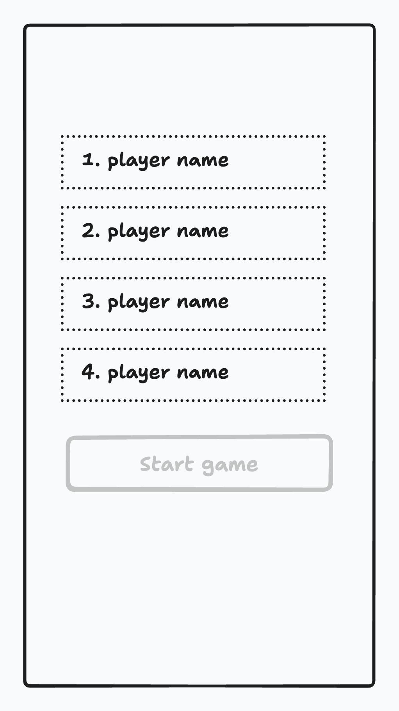
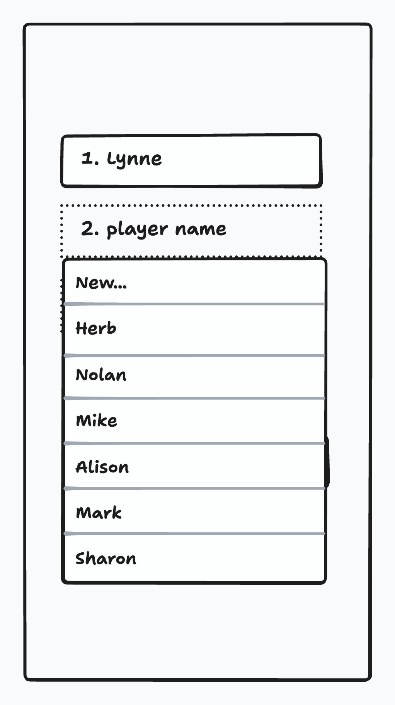
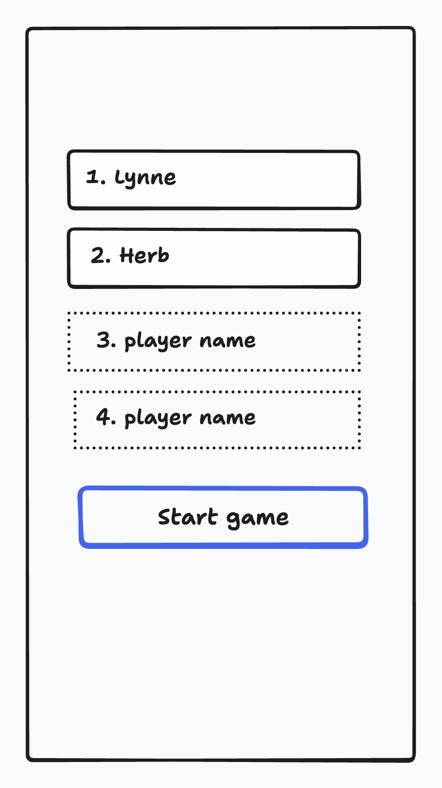
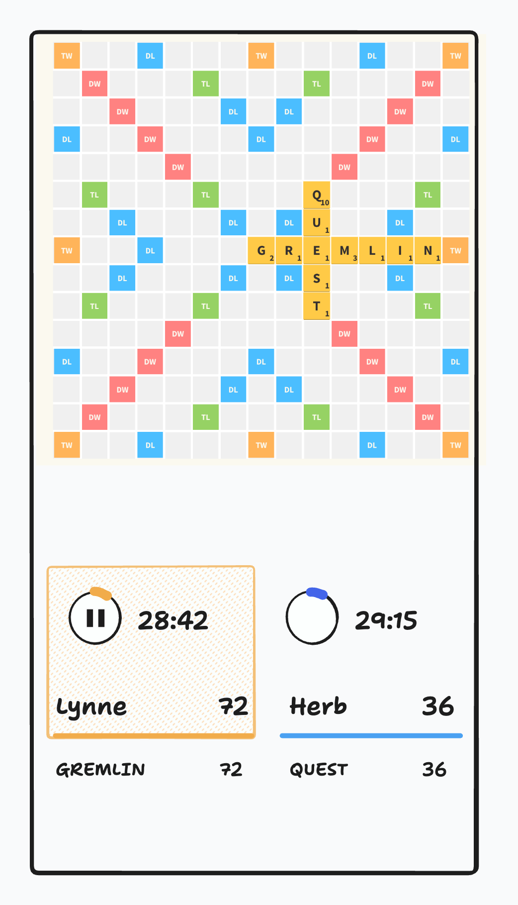

# Scrabble score keeper

This is a web application designed to be used by people playing Scrabble in person on a physical board.

## Features

### Scoring

A player can enter moves on an on-screen scrabble board. The app scores each move and keeps track of each player's running score.

### Timekeeping

The app has a chess-style clock where each player has N minutes available, and their thinking time for each turn is deducted from their total time. The clock can be paused and restarted.

### Sharing

Multiple players can see the same game and keep score collaboratively. This is done in a local-first way: Game data is stored locally and synced.

## Interface

### Screen 1: Home Screen

The home screen features a large "New game" button at the top, prominently displayed with a blue border to indicate it's the primary action. Below it is a "Past games" section showing a history of completed games. Each game entry displays:

- The date of the game (e.g., "Oct 23", "Oct 29")
- Player names for that game
- Final scores for each player
- A trophy icon (🏆) next to the winner's score

The layout is clean and simple, with the past games list showing two players per game with their respective scores. The most recent games appear at the top of the list.

### Screen 2: Player Setup

When starting a new game, the player setup screen displays input fields for up to 4 players. Each field is presented as a dashed-border box containing placeholder text "player name" with a number prefix (1., 2., 3., 4.). At the bottom is a "start game" button that remains disabled (shown in gray) until enough players have been entered.

The interface is minimalist, focusing on the essential task of collecting player names before beginning gameplay.

### Screen 3: Player Name Selection

When tapping on a player name input field, a dropdown menu appears showing available player names. The first option is "New..." to allow entering a completely new name. Below that are previously-used names from past games (Herb, Nolan, Mike, Alison, Mark, Sharon), listed in descending order of frequency of use.

The dropdown overlays the input fields and provides quick access to frequently-played participants, reducing the need to retype names for regular players.

### Screen 4: Ready to Start

Once at least two players have been entered (shown here: "1. Lynne" and "2. Herb"), the "start game" button becomes active and is highlighted with a blue border to indicate it's ready to be pressed. The remaining empty player slots (3 and 4) still show their placeholder text with dashed borders, indicating they're optional.

This screen confirms that the minimum requirement for starting a game has been met.

### Screen 5: Game Board with Timer Start

The main gameplay screen shows:

- A full 15×15 Scrabble board at the top with :
  - DL (Double Letter): normal (light) square with two dots
  - TL (Triple Letter): normal (light) square with three dots
  - DW (Double Word): reversed (dark) square with two dots
  - TW (Triple Word): reversed (dark) square with three dots
  - A bulls-eye in the center indicating the starting position
- A "▶ start timer" button below the board
- Player panels at the bottom showing:
  - Player names
  - Circle indicators visualizing time remaining (both showing 30:00)
  - Current score (both showing 0)

Each player is assigned a color, which is used in their time visualization and as a background color when it is their turn.

### Screen 6: Active Gameplay

During active gameplay, the screen shows the Scrabble board with placed tiles displaying a word

- Each tile shows the letter and its point value in the corner
- The tiles are displayed in tan color on the board

Each player has a panel showing:

- Time remaining
- Current score
- A list of words played along with their scores, starting with the most recent

The active player panel (highlighted with that player's color background) shows a pause button (‖) inside the circle. The active player's timer is counting down and can be paused, while the inactive player's timer is static. The interface provides a clear visual indication of whose turn it is through the background highlighting and timer state.
